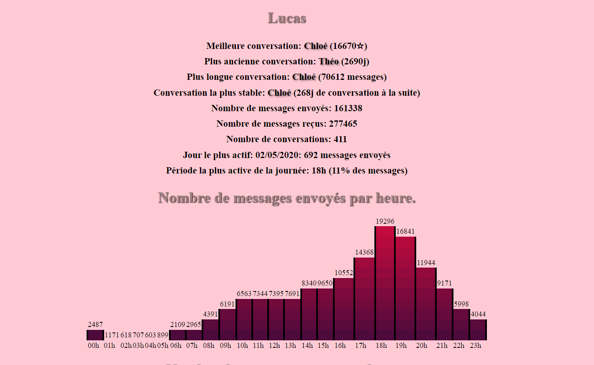
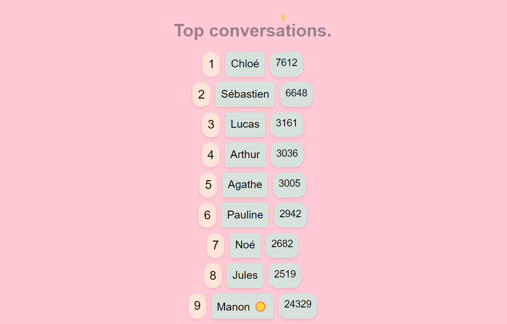
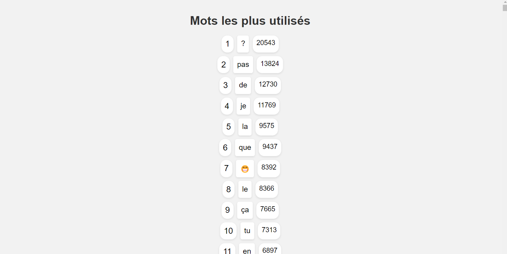
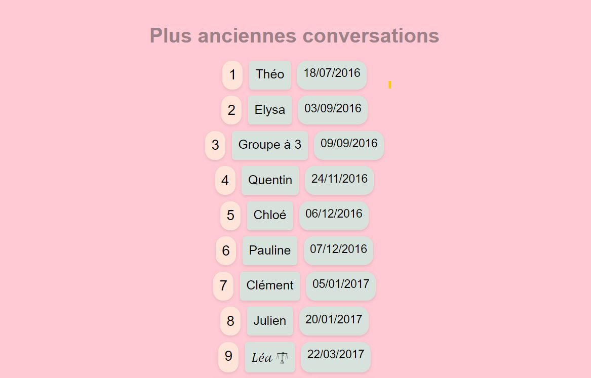
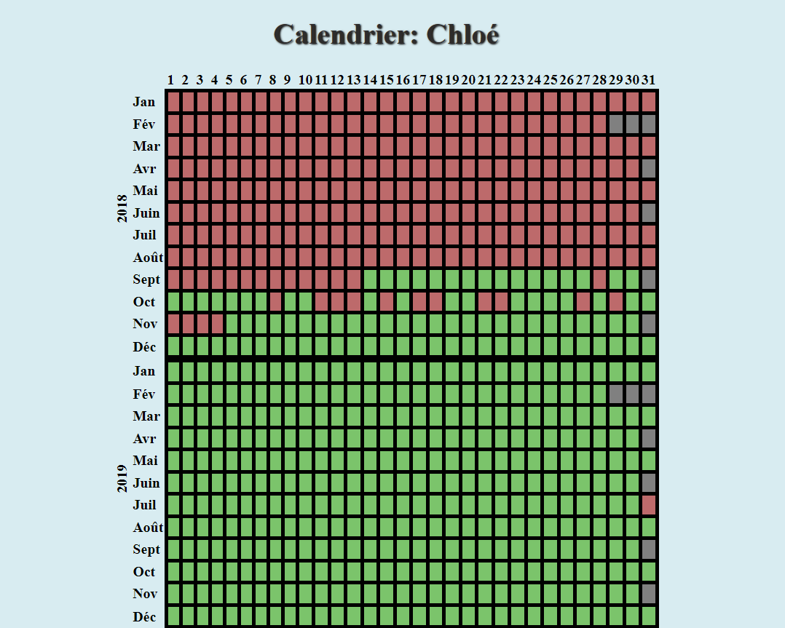
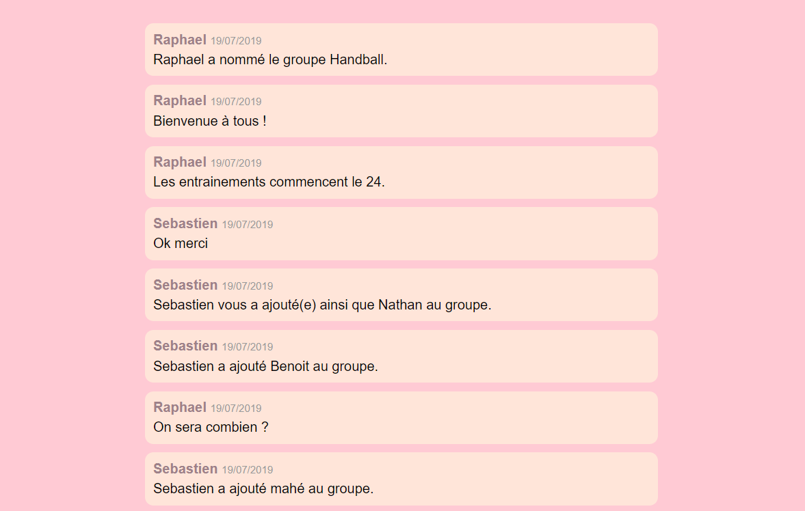

# Traitement des données d'un compte Instagram.
Instagram permet de récupérer ses propre données personnelles. J'ai décidé de récupérer mes données textuelles au format JSON, et de les traiter.
Voici les données auxquelles on a accès.

## Données globales du compte

Il s'agit d'un récapitulatif de certaines données de l'ensemble des conversations d'un compte.
Un "score de conversation" est calculé pour chaque conversation, en fonction de la taille de la conversation, de sa fréquence et de son ancienneté.
Le graphique affiché montre le nombre de messages envoyés à chaque tranche horaire.

## Plus longues conversations

## Mots les plus employés

## Plus anciennes conversations

# Accès aux différentes conversations et données associées

Pour chaque conversation, un calendrier est généré, avec une case verte pour les jours où il y a eu un message dans la conversation, et une rouge dans les cas contraires.
Cliquer sur une case verte du calendrier ouvre la conversation à la date souhaitée:

Un résumé des données propre à la conversation uniquement est aussi disponible:

# Langages utilisés
Ce projet est fait entièrement en Python, et j'ai essayé d'utiliser le moins de librairies possible.
L'affichage est fait via HTML/CSS, généré par mon script Python.

# Lancer le traitement
Pour commencer le traitement, extraire le fichier donné par instagram dans le dossier "raw", puis exécuter le fichier "main".

